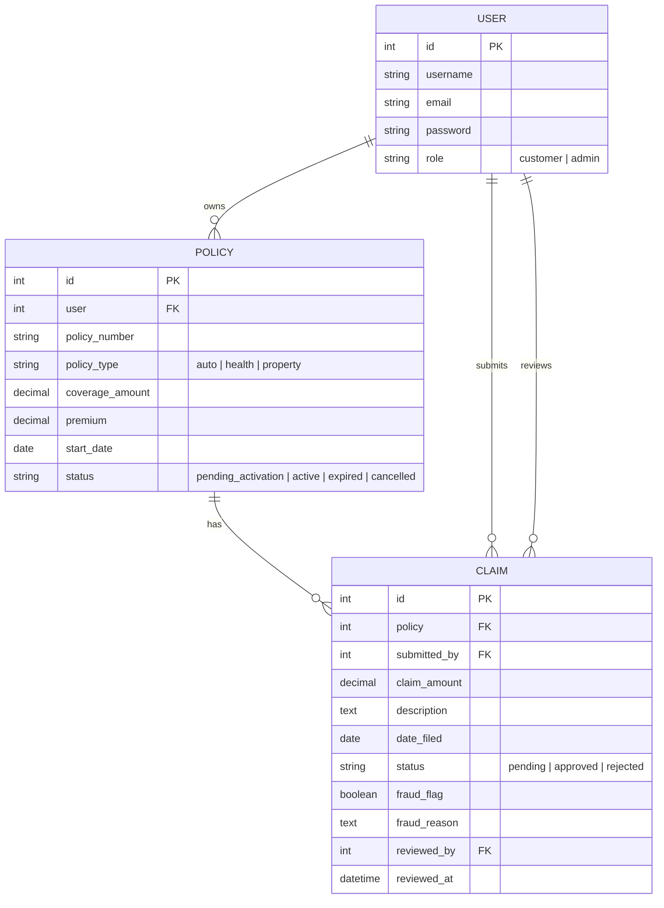
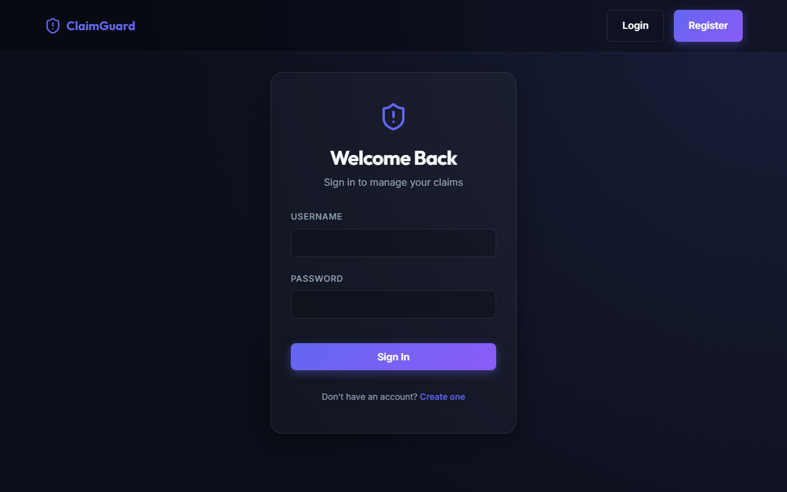

<p align="center">
  
</p>

<p align="center">
  
</p>

<p align="center">
  
  
  
  
  
  
</p>

## Table of Contents
- [Problem Statement](#problem-statement)
- [Live Demo](#live-demo)
- [Architecture](#architecture)
- [Data Model](#data-model)
- [Fraud Detection Engine](#fraud-detection-engine)
- [Security Highlights](#security-highlights)
- [Design Decisions](#design-decisions)
- [Tech Stack](#tech-stack)
- [API Reference](#api-reference)
- [Getting Started](#getting-started)
- [Testing](#testing)
- [Screenshots](#screenshots)
- [Future Improvements](#future-improvements)

## Problem Statement
This system provides a modern, secure web application for customers to manage insurance policies and file claims, while equipping administrators with automated tools to detect potentially fraudulent activity. By enforcing strict Role-Based Access Control (RBAC) and executing a deterministic, explainable fraud-detection engine on every submission, the platform significantly reduces the manual workload of claims adjusters while maintaining a transparent and defensible audit trail.

## Live Demo
<!-- TODO: record demo.gif — login, flagged claim submission, admin review and place it at docs/screenshots/demo.gif -->
<p align="center">
  
</p>

## Architecture
```
┌─────────────────────┐
│  React + TypeScript │   (SPA, JWT in memory/context, axios client)
└──────────┬───────────┘
           │ HTTPS / JSON
┌──────────▼───────────┐
│  Django REST API     │   (stateless, versioned at /api/v1/)
│  - auth (JWT)        │
│  - policies app      │
│  - claims app        │
│    - fraud service   │
└──────────┬───────────┘
           │ ORM
┌──────────▼───────────┐
│     PostgreSQL       │
└──────────────────────┘
```
*Note: Django apps are split by domain (accounts / policies / claims) rather than by technical layer. Each app owns its own models, serializers, views, permissions, and tests. This idiomatic approach keeps business logic (like the fraud engine) co-located with the models it operates on.*

## Data Model


## Fraud Detection Engine
The automated fraud detection engine evaluates every incoming claim against three deterministic rules. If any rule fires, the claim is flagged for administrative review, and the specific reasons are recorded.

1. **Rule 1 — High-amount rule:** Flags a claim if its amount exceeds 3× the historical average claim amount for that specific policy type across the entire system.
   * **Cold-start guard:** This rule requires a minimum of 5 prior claims of that policy type to exist in the system. The rule doesn't have enough history to be statistically meaningful yet, so it doesn't fire until it does.
2. **Rule 2 — Early-claim rule:** Flags a claim if it is filed within 7 days of the policy's start date.
3. **Rule 3 — Near-total-payout rule:** Flags a claim if the requested amount is 90% or more of the policy's maximum coverage amount.

## Security Highlights

| Risk | Mitigation |
|---|---|
| Broken Object-Level Authorization (BOLA) | Ownership of the referenced policy is verified server-side on every claim submission — never inferred from what the frontend displays |
| Mass assignment | `role`, `status`, `fraud_flag`, `fraud_reason`, `reviewed_by`, `reviewed_at`, and `submitted_by` are all read-only fields in every serializer where a non-admin could otherwise set them |
| Fraud-reason leakage | `fraud_reason` is never included in a customer-facing API response — enforced with separate admin/customer serializers, not a frontend-only filter |
| Financial precision | All monetary fields use `DecimalField` with explicit precision — never `float` — preventing rounding drift on claim amounts |
| Token exposure | JWTs are held in React state/Context, not `localStorage`, reducing exposure to XSS-based token theft |

## Design Decisions
* **Service Function for Fraud Logic:** The fraud engine is a pure Python function (`check_fraud(claim)`) rather than a `save()` override or a model method. This keeps complex business logic out of the data layer, allows independent unit testing without database writes, and treats the audit trail as an explicit return value rather than a hidden side effect.
* **Role Field vs Django Groups:** Using a simple `role` field on the custom User model avoids the overhead and complexity of Django's built-in Groups/Permissions system, which is overkill for a strict binary (customer vs admin) authorization model.
* **JWT in Memory vs localStorage:** JWTs are stored strictly in React state/Context. While `localStorage` provides persistence across reloads, it is highly vulnerable to Cross-Site Scripting (XSS) attacks. Storing tokens in memory enforces a much stronger security posture.
* **Pending → Active Policy Flow:** Policies are created in a `pending_activation` state rather than instantly becoming `active`. This ensures an administrator explicitly reviews and underwrites the coverage before the system assumes liability, mirroring the claim review process.

## Tech Stack
* **Backend:** Django & Django REST Framework (DRF) — chosen for its robust ORM, built-in serialization, and rapid development capabilities for REST APIs.
* **Database:** PostgreSQL — chosen for strict data integrity, transactions, and native `Decimal` field support to prevent floating-point financial drift.
* **Auth:** SimpleJWT — provides stateless authentication compatible with modern SPA architectures.
* **Frontend:** React + TypeScript + Vite — chosen for fast compilation, strict type safety, and component-driven UI architecture.
* **Styling:** Vanilla CSS with Custom Properties — chosen for maximum control over the premium glassmorphic aesthetic without the overhead of external UI libraries.

## API Reference

| Method | Path | Auth Req | Role Req | Request Body | Response Shape |
|---|---|---|---|---|---|
| POST | `/api/v1/auth/register/` | No | None | `{username, email, password}` | `{id, username, email, role}` |
| POST | `/api/v1/auth/login/` | No | None | `{username, password}` | `{access, refresh}` |
| POST | `/api/v1/auth/refresh/` | No | None | `{refresh}` | `{access}` |
| GET | `/api/v1/policies/` | Yes | Any | - | Paginated `Policy[]` |
| POST | `/api/v1/policies/` | Yes | Any | `{policy_type, coverage_amount, premium, start_date}` | `Policy` |
| PATCH | `/api/v1/policies/<id>/activate/` | Yes | Admin | `{status}` | `Policy` |
| GET | `/api/v1/policies/<id>/` | Yes | Owner/Admin | - | `Policy` |
| GET | `/api/v1/claims/` | Yes | Any | - | Paginated `Claim[]` |
| POST | `/api/v1/claims/` | Yes | Any | `{policy, claim_amount, description}` | `Claim` |
| GET | `/api/v1/claims/<id>/` | Yes | Owner/Admin | - | `Claim` |
| PATCH | `/api/v1/claims/<id>/review/` | Yes | Admin | `{status}` | `Claim` |
| GET | `/api/v1/claims/flagged/` | Yes | Admin | - | Paginated `Claim[]` (Admin fields) |

## Getting Started

<details>
<summary><strong>Backend setup</strong> (click to expand)</summary>

1. `cd backend`
2. Create a `.env` file with `SECRET_KEY`, `DATABASE_URL`, `DEBUG=True`
3. `python -m venv venv && source venv/bin/activate` (or `venv\Scripts\activate` on Windows)
4. `pip install -r requirements.txt`
5. `python manage.py migrate`
6. `python manage.py runserver`

</details>

<details>
<summary><strong>Frontend setup</strong> (click to expand)</summary>

1. `cd frontend`
2. Create a `.env` file with `VITE_API_BASE_URL=http://localhost:8000/api/v1/`
3. `npm install`
4. `npm run dev`

</details>

## Testing
* **Backend:** `cd backend` -> `python manage.py test` (Testing is natively validated by GitHub Actions in the cloud)
* **Frontend:** `cd frontend` -> `npm run test` (Vitest test suites run on PR/Push)

## Screenshots
<!-- TODO: Add actual screenshot PNG files to the docs/screenshots/ directory with the exact filenames listed below. -->
<p align="center">
  
  
</p>
<p align="center">
  
</p>

## Future Improvements
* **ML-based Fraud Scoring:** Integrate a machine learning model to complement the deterministic rule engine for identifying nuanced, non-linear fraud patterns.
* **Redis Caching:** Cache the historical policy-type averages used in Fraud Rule 1. Recomputing this aggregate across millions of rows on every submission will not scale.
* **Full Audit Log:** Implement a dedicated audit trail table (e.g., using `django-simple-history`) to record all state transitions, rather than just storing the most recent reviewer in the `Claim` model.
* **Docker Compose:** Containerize the backend, frontend, and PostgreSQL databases for a single-command local development environment.
* **Production CORS Configuration:** Explicitly bind `CORS_ALLOWED_ORIGINS` to the exact deployed frontend origin domain for robust security in production environments.

<p align="center">
  
</p>
